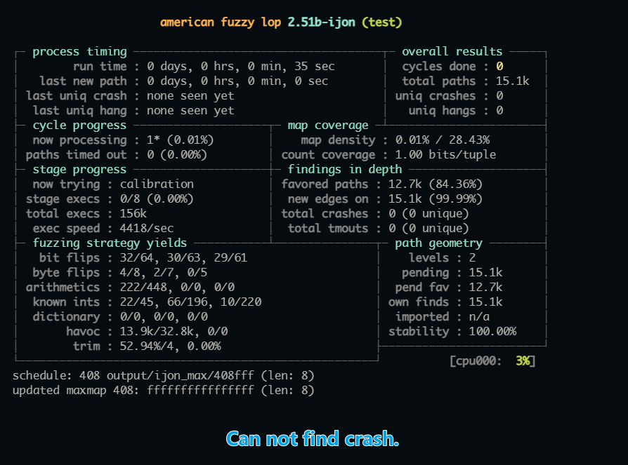

### Prompt Template:

```
You are a professional fuzzing practioner, and you have the following marcos:
#MACRO DESCRIPTIONS START
IJON_INC(x): if x is changed, new coverage is generated.
IJON_SET(x): if x is changed, new coverage is generated.
IJON_BITS(x): If the number of zeros in the highest bit of x changes, a new coverage is generated.
IJON_MAX(x): If x is larger than before, a new coverage is generated.
IJON_MIN(x): If x is smaller than before, a new coverage is generated.
IJON_CMP(x,y): The number of different bits for x and y changes and a new coverage is generated.
IJON_DIST(x,y): The absolute distance between x and y (ABS) changes and a new coverage is generated.
IJON_STRDIST(x,y): The similarity of strings x and y changes and a new coverage is generated.
#MACRO DESCRIPTIONS END

Now given the following program under test(PUT):
#PUT START
// PUT Here
#PUT END

Insert fewer the better these macros into the PUT to achieve the following target:
#TARGET START
// Target Here
#TARGET END
```


### 1. Maze:

Prompt:

```
You are a professional fuzzing practioner, and you have the following marcos:
#MACRO DESCRIPTIONS START
IJON_INC(x): if x is changed, new coverage is generated.
IJON_SET(x): if x is changed, new coverage is generated.
IJON_BITS(x): If the number of zeros in the highest bit of x changes, a new coverage is generated.
IJON_MAX(x): If x is larger than before, a new coverage is generated.
IJON_MIN(x): If x is smaller than before, a new coverage is generated.
IJON_CMP(x,y): The number of different bits for x and y changes and a new coverage is generated.
IJON_DIST(x,y): The absolute distance between x and y (ABS) changes and a new coverage is generated.
IJON_STRDIST(x,y): The similarity of strings x and y changes and a new coverage is generated.
#MACRO DESCRIPTIONS END

Now given the following program under test(PUT):
#PUT START
#include <stdlib.h>
#include <stdio.h>
#include <unistd.h>
#include <assert.h>
#include <stdbool.h>

#define H 13
#define W 17

char maze[H][W]={
"+-+-------------+",
"| |             |", 
"| | +-----* *---+",
"|   |           |",
"+---+-* *-------+",
"|               |",
"+ +-------------+",
"| |       |   |#|",
"| | *---+ * * * |",
"| |     |   |   |",
"| +---* +-------+",
"|               |",
"+---------------+",};

void draw ()
{
	int i, j;
	for (i = 0; i < H; i++)
	  {
		  for (j = 0; j < W; j++)
				  printf ("%c", maze[i][j]);
		  printf ("\n");
	  }
	printf ("\n");
}

int main (int argc, char *argv[]){
	int x, y;     //Player position
	int ox, oy;   //Old player position
	int i = 0;    //Iteration number
#define ITERS 512
	char program[ITERS];
	x = 1;
	y = 1;
	maze[y][x]='X';
	draw();
	read(0,program,ITERS);
	while(i < ITERS)
	{
#ifndef MAZE_NO_BT
		maze[y][x]=' ';
#endif
		ox = x;    //Save old player position
		oy = y;
    //transition(hashint(x,y));
		switch (program[i])
		{
			case 'w':
				y--;
				break;
			case 's':
				y++;
				break;
			case 'a':
				x--;
				break;
			case 'd':
				x++;
				break;
			default:
				printf("Wrong command!(only w,s,a,d accepted!)\n");
				printf("You lose!\n");
				exit(-1);
		}
		if (maze[y][x] == '#')
		{
      assert(0);
		}
		if (maze[y][x] != ' ') {
			x = ox;
			y = oy;
		}
#ifdef MAZE_NO_BT
		if (ox==x && oy==y){
			printf("You lose\n");
			exit(-2);
		}
#endif

		maze[y][x]='X';
		draw ();          //draw it
		i++;
	}
	printf("You lose\n");
}
#PUT END

Insert fewer the better these macros into the PUT to achieve the following target:
#TARGET START
Help fuzzer find the exit of the maze as soon as possible.
#TARGET END
```

Answer:

Code generated by `GPT-4o0Mini`:

```c
// ...
int main (int argc, char *argv[]){
	int x, y;     //Player position
	int ox, oy;   //Old player position
	int i = 0;    //Iteration number
	// ...
	while(i < ITERS)
	{
#ifndef MAZE_NO_BT
		maze[y][x]=' ';
#endif
		ox = x;    //Save old player position
		oy = y;

		// Insert macros to track changes
        // Answer given by the autor is IJON_SET(hash_int(x,y))
		IJON_SET(x);
		IJON_SET(y);
		IJON_CMP(x, ox);
		IJON_CMP(y, oy);

		switch (program[i]){
			case 'w':
				y--;
				break;
			case 's':
				y++;
				break;
			case 'a':
				x--;
				break;
			case 'd':
				x++;
				break;
			//...
		}
		//...
}
```

It gives reasons:

```
IJON_SET(x); and IJON_SET(y);: These macros will trigger new coverage if the player’s position changes, helping the fuzzer track the player's movement through the maze.

IJON_CMP(x, ox); and IJON_CMP(y, oy);: These macros check for changes in the player's position compared to the old position. This will generate new coverage whenever the player moves, allowing the fuzzer to explore different paths.
```

I tried to fuzz this one compared to the sample given by the author:


I'll continue to explore the differences between these two types of mazes. But from this example, it's important to use the IJON API efficiently and accurately.

### 2. Arithmetic calculation

```
You are a professional fuzzing practioner, and you have the following marcos:
#MACRO DESCRIPTIONS START
IJON_INC(x): if x is changed, new coverage is generated.
IJON_SET(x): if x is changed, new coverage is generated.
IJON_BITS(x): If the number of zeros in the highest bit of x changes, a new coverage is generated.
IJON_MAX(x): If x is larger than before, a new coverage is generated.
IJON_MIN(x): If x is smaller than before, a new coverage is generated.
IJON_CMP(x,y): The number of different bits for x and y changes and a new coverage is generated.
IJON_DIST(x,y): The absolute distance between x and y (ABS) changes and a new coverage is generated.
IJON_STRDIST(x,y): The similarity of strings x and y changes and a new coverage is generated.
#MACRO DESCRIPTIONS END

Now given the following program under test(PUT):
#PUT START
int main(int argc, char** argv){
  int a = 0;
  int b = 0;
  if(read(0, &a, sizeof(a)) != sizeof(a)){
    printf("failed to read input\n");
    exit(1);
  }else{
    printf("read %d\n",a);
  }

  if(read(0, &b, sizeof(b)) != sizeof(b)){
    printf("failed to read input\n");
    exit(1);
  }else{
    printf("read %d\n",b);
  }

  int o = 213456;
  int m = 13;

  printf("a+%d == %d*b (%d == %d)\n",o,m,a+o, b*m);
  if(a+o==m*b){
    assert(false);
  }
}

#PUT END

Insert fewer the better these macros into the PUT to achieve the following target:
#TARGET START
Find the right a and b to make the equation equal.
#TARGET END
```

Code generated by `GPT-4o0Mini`:

```c
int main(int argc, char** argv){
  int a = 0;
  int b = 0;

  if(read(0, &a, sizeof(a)) != sizeof(a)){
    printf("failed to read input\n");
    exit(1);
  }else{
    printf("read %d\n", a);
  }

  if(read(0, &b, sizeof(b)) != sizeof(b)){
    printf("failed to read input\n");
    exit(1);
  }else{
    printf("read %d\n", b);
  }

  int o = 213456;
  int m = 13;

  printf("a+%d == %d*b (%d == %d)\n", o, m, a + o, b * m);

  // Insert macros to track changes in a and b
  IJON_INC(a);
  IJON_INC(b);
  IJON_MAX(a);
  IJON_MIN(b);
  
  // Check the condition
  if(a + o == m * b){
    assert(false); // This assertion will fail if the condition is met
  }
}
```

It gives reasons:

```
IJON_INC(a): This macro checks if a is modified, which will help in identifying new coverage based on different inputs for a.
IJON_INC(b): Similar to IJON_INC(a), this tracks changes to b.
IJON_MAX(a): This tracks if a exceeds its previous maximum value, which is useful for finding larger values that could satisfy the equation.
IJON_MIN(b): This tracks if b falls below its previous minimum value, encouraging exploration of smaller values for b.
```

**I do not think it is a good way since the result is linear between `b` and `a`, maximizing `a` and minimizing `b `does not help find the result.**

I tried to fuzz this one above and the result is bad:



