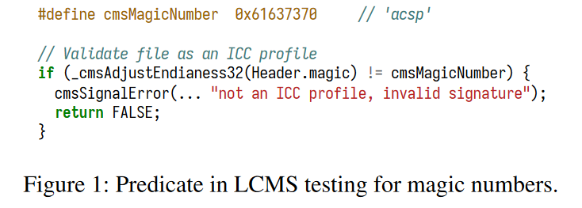
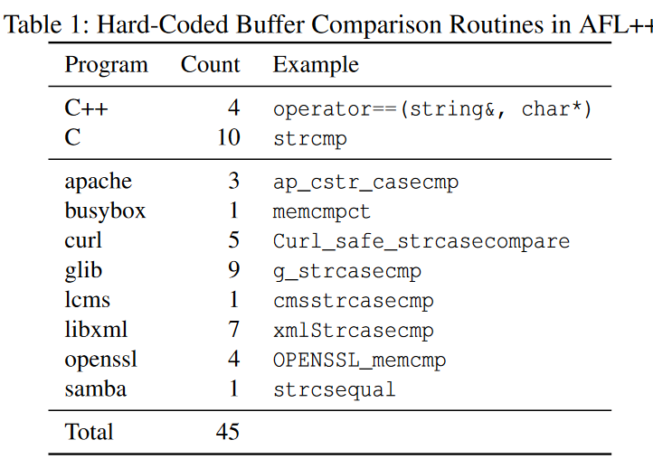
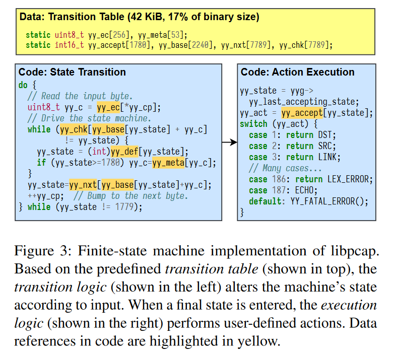
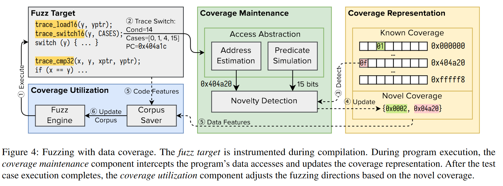

# Data Coverage for Guided Fuzzing

## 1. Motivation

- **Example 1:**

在提供的代码片段中(检查magic number)，代码覆盖率只能确定检查是通过还是失败。但是，当检查失败时，无论猜测的值与正确值有多接近，代码覆盖率都保持不变。在没有有效指导的情况下，模糊器必须盲目 “猜测 ”数值，这意味着猜测成功的可能性为 2的-32次方。

故现有的code coverage对简单的数据判断的指导性都很差。

AFL++硬编码定义了一些比较，：

当遇到这些比较时，其会通过一个`CmpLog` instrumentation来记录比较的操作数，然后通过一些定制的启发式方法来变异，更好的解决这些问题。但是这些方法的扩展性很差。

- **Example 2:**

这是一个词法转换器的例子，为了探索 libpcap 程序，fuzzer需要在自动机中触发新的状态转移，达到新的接受状态，并最终执行新的程序逻辑。然而，机器逻辑的简单性导致左边的代码覆盖率饱和，右边的则停滞。

由于fuzzer的覆盖范围滞留在右侧的 switch 语句中，因此模糊器向约束求解器寻求帮助。Concolic execution无法符号化间接内存访问，退回到 yy_act 的具体版本，无法求解。由于 yy_act 的值与输入数据没有直接关系，因此预定义的突变策略不适用，智能分支求解也失败了。因此，没有一个求解器能有效地探索状态机并触发新的动作。

## 2. Methodology

将每个data access建模为(address, length)，address以字节为单位，而length则以比特为单位。

(有点类似Shadowmem.)

作者实现了data access instrumntation，在fuzzing的过程中实时更新date coverage。

## 3. Evaluation