# IJON(S&P'20)

>[IEEE Xplore Full-Text PDF:](https://ieeexplore.ieee.org/stamp/stamp.jsp?tp=&arnumber=9152719)
>
>Code: https://github.com/RUB-SysSec/ijon

## 1. Motivation

>Current fuzzing methods struggle to explore complex state machines. 

单一的coverage-based fuzzing无法处理复杂的，路径依赖相关的Bug.

现有工业界的fuzzing practitioner的做法：

1. 先运行fuzzing一段时间，然后分析code coverage；
2. 分析和改进fuzzing process以提供code coverage (例如，删除目标中的一些很难的部分，改变突变策略或者直接往input corpus中加样本);

--> Manual tuning is required.


## 2. Method

**State Exploration:**

- **Known Relevant State Values:** 如果程序中只有很小一部分状态是interesting的，fuzzer可能在大多数时候都得不到code coverage的反馈，人类若可以分辨这部分state就可以用于指导fuzzer。

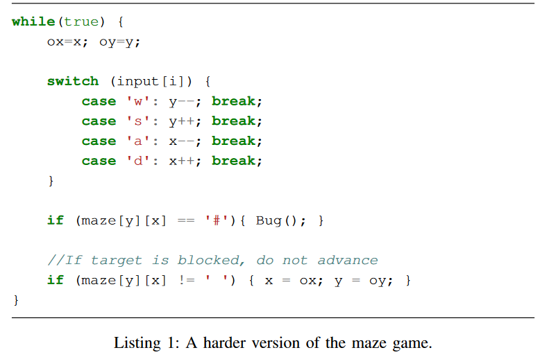

​	对这个例子而言，迷宫的state有几百个（x,y）组合，但是代码中只有4条分支，所以fuzzer就算获取了大部分的coverage也很难探索到bug。但是分析人员可以将每一种(x,y)视为一种新状态，告知fuzzer，这样就可以遍历所有可能的情况。

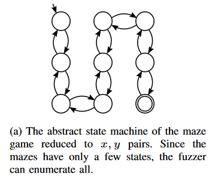


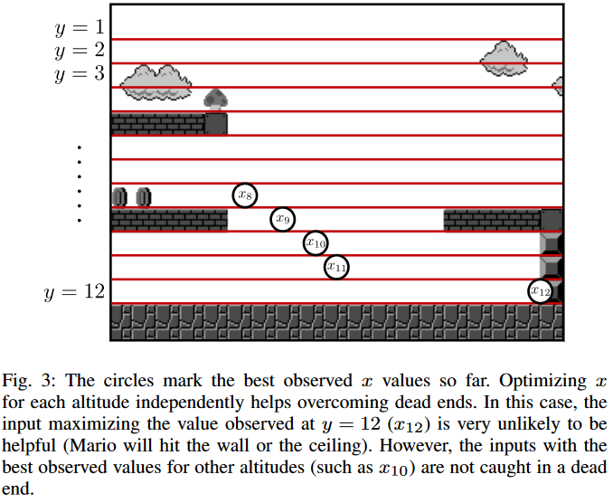

  再如对超级玛丽来说，由于其坐标数量大概是10^6^数量级，完全遍历每个(x,y)并不明智。分析师可以指定x坐标的增加代表着新的状态，这样就可以很好地规避无用的中间结果。


- **Known State Changes：**若程序过于复杂，或者很难分辨哪些变量会与interesting state有关，在这种情况下（没有Known Relevant State Value），人类可以分辨出代码里那部分可能跟这些有关。例如，例如，许多程序会单独处理信息或输入块，处理不同类型的输入块很可能会以不同方式改变状态。这种情况通常发生在使用高度结构化数据的应用程序中，如消息序列或文件格式中的块列表。

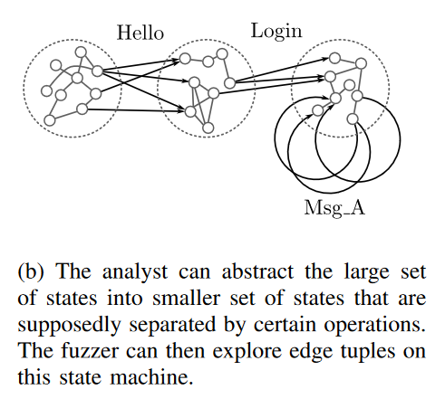

  例如对于以下protocol处理代码，fuzzer很难生成有效的信息类型进而覆盖所有分支。

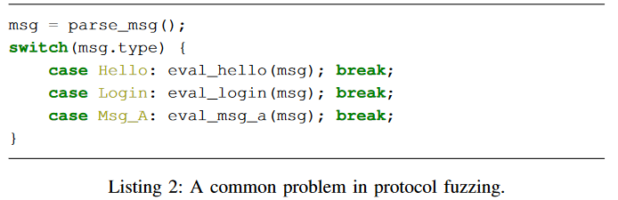

​	分析人员可以通过使用成功处理的报文类型日志，使fuzzer能够更有效地探索由报文组合产生的不同状态。


- **Missing Intermediate State：**如果以上两种信息都没有，分析人员可以创建人工中间状态来引导fuzzer。一个典型的例子是magic byte checks，AFL及其类似的fuzzer都没有办法很好的处理它。

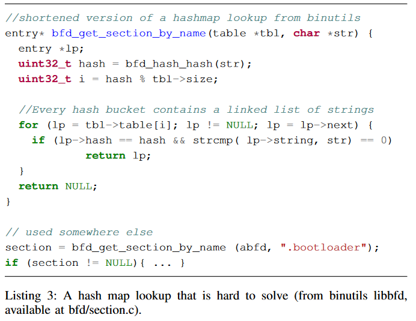

  这个例子的难点在于，if(lp->hash == hash && strcmp( lp->string, str) == 0)需要在满足第一个条件（哈希值相等）的条件下逐一比较lp->string和str的每个字符是否相同，这点对于随机变异的fuzzer和符号执行来说很困难。

  人类分析者可以有效识别出这是一个一对多的字符串比较（每个lp->string vs. str），即可以将其转化为一系列简单的单一字符串比较来简化操作。


**作者定义了四个primitives:**

>1. 我们允许分析人员选择与解决当前问题相关的代码区域。
>2. 我们允许直接访问 AFL bitmap来存储附加值。Bitmap entries可以直接设置或增加，因此可以改变feedback状态值。
>3. 我们让分析人员能够影响coverage的计算。这就允许相同的edge coverage产生不同的bitmap coverage。这样就能在不同状态下创建更精细的反馈.
>4. 我们引入了一个可以让用户添加hill climbing optimizaiton(贪心)优化的primitive，这样在状态空间太大时就可以为用户提供一个目标。


**IJON Implementations：**

fuzzing process 1--> 人工分析 --> fixed fuzzing process 2 --> get new coverage input --> feed back to process 1

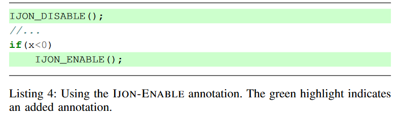

`IJON-ENABLE()`和`IJON-DISABLE()`可以允许/禁止当前fuzzing获取代码覆盖率，从而排除一些不想fuzz的代码块。

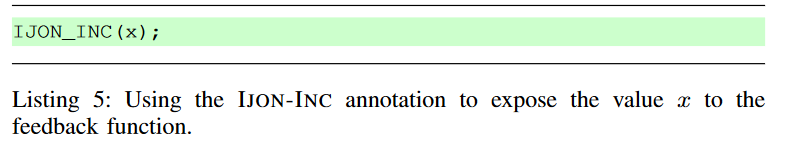

`IJON_INC()`用于增加bitmap中的coverage。例如上图的x若等于5，我们可以用5，文件名和Line number计算出bitmap中对应的index，并增加其值。

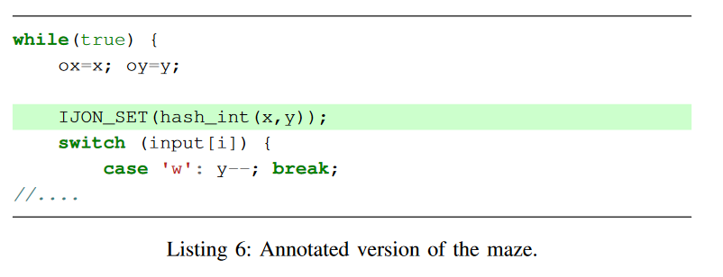

`IJON_SET()`可以直接设置bitmap中对应entry的值，如上图在每个循环开始处更新bitmap从而达到让fuzzer探索不同(x,y)组合的目的。

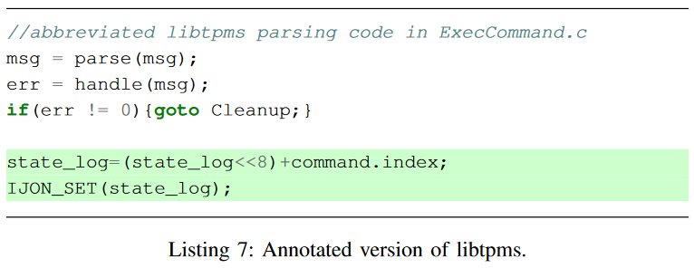

如上图，在成功处理msg后，增加了两行代码，其作用是将成功处理的命令索引添加到state_log中，并根据此更新bitmap，这样fuzzer就会更聚焦于被成功处理了的msg上。

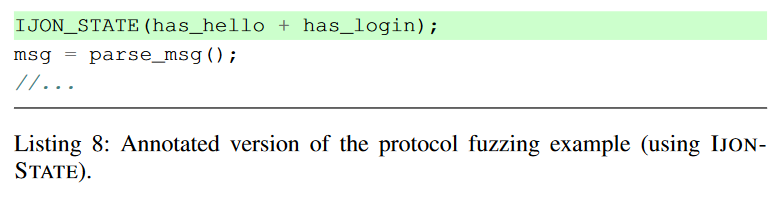

`IJON_STATE()`的作用是改变coverage的计算方式，其在计算edge coverage时添加了一个虚拟state。当这个虚拟state改变时，任何edge都会触发新的coverage。

在分析协议之前，程序告诉模糊器如果msg中`has_hello`和`has_login`发生了变化, 就对之后的所有edge给予更多coverage。

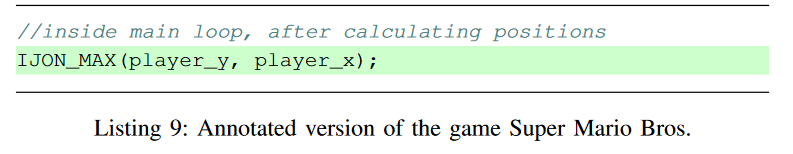

`IJON_MAX`会让fuzzer进入hill climbing optimizaiton的模式，其作用是在过大的探索空间中优先找到目标，摒弃冗杂的中间值。`IJON_MAX（y,x）`的作用是在每个y上用登山算法贪心找到最大化x的值。使用多个slot的目的是为了避免陷入死胡同。


**Adding Annotations**

AFL自带的compiler pass可以实现code coverage的获取。**作者扩展并修改了这些pass，和编译器warper，并提供了一个额外的runtime library用于给编译器静态链接使用。** 这个runtime library实现了很多helper functions和macros用于添加annotation。

`IJON-ENABLE`: 引入一个mask用于改变coverage的计算方式，mask为0表示只有bitmap的第一个enrty可以被访问和修改；为0xffff则表示所有都可以。

`IJON-INC` and `IJON-SET`：对于IJON-INC(n)来说，bitmap中第n个entry被增加；对于IJON-SET(n)来说，bitmap中第n个entry被设置为1。

`IJON-STATE`：这个函数直接改变了全局coverage的计算方式，其会将一个state n加入bitmap的计算中 （state⊕(ids ∗2)⊕idt），重复调用IJON_STATE(n)时，state以这种方式累加：state := state ⊕ n。

`IJON-MAX`：这个函数用于实现将某些值最大化的要求（例如超级玛丽中的x轴），其最高支持512个slot，每个slot都会单独尽力达到最大值。为了存储这些值，作者实现了一个额外的max-map，调用IJON_MAX(slot,val)时，会做操作：maxmap[slot]=max(maxmap[slot], val)。

在运行一次后，fuzzer会同时检查bitmap和maxmap以确定是否产生新的coverage。


**New code in rep**

作者在最新的仓库中更新了相关API：

```c
void ijon_map_inc(uint32_t addr){ 
  __afl_area_ptr[(__afl_state^addr)%MAP_SIZE]+=1;
}

void ijon_map_set(uint32_t addr){ 
  __afl_area_ptr[(__afl_state^addr)%MAP_SIZE]|=1;
}
```

共享内存的地址在初始化后存储在指针：`__afl_area_ptr`。这里就是直接设置对应bitmap的值。

```C
void ijon_xor_state(uint32_t val){
  __afl_state = (__afl_state^val)%MAP_SIZE; //state := state ⊕ val
}
```
`ijon_push_state`用于应对例如listing 7的情况：

```c
void ijon_push_state(uint32_t x){
  ijon_xor_state(__afl_state_log);
  __afl_state_log = (__afl_state_log << 8) | (x & 0xff);
  ijon_xor_state(__afl_state_log);
}
```

`ijon_strdist`用于计算两个字符串最大公共前缀长度：

```c
uint32_t ijon_strdist(char* a,char* b){
  int i = 0;
  while(*a && *b && *a++==*b++){
    i++;
  }
  return i;
}
```

`ijon_memdist`相较于`ijon_strdist`指定了函数：

```c
uint32_t ijon_memdist(char* a,char* b, size_t len){
  int i = 0;
  while(i < len && *a++==*b++){
    i++;
  }
  return i;
}
```

`ijon_enable_feedback`/`ijon_disable_feedback`通过指定`__afl_mask`变量改变bitmap的计算方式：

```c
void ijon_enable_feedback(){
	__afl_mask = 0xffffffff;
}
void ijon_disable_feedback(){
	__afl_mask = 0x0;
}
```

`__afl_mask`具体在apply_mask中使用(afl-tmin.c)，计算bitmap中的每个byte，并进行masking操作：

```c
static void apply_mask(u32* mem, u32* mask) {
  u32 i = (MAP_SIZE >> 2);
  if (!mask) return;
  while (i--) {
    *mem &= ~*mask;
    mem++;
    mask++;
  }
}
```

`ijon_simple_hash`是一个简单快速hash方法：

```c
uint64_t ijon_simple_hash(uint64_t x) {
    x = (x ^ (x >> 30)) * UINT64_C(0xbf58476d1ce4e5b9);
    x = (x ^ (x >> 27)) * UINT64_C(0x94d049bb133111eb);
    x = x ^ (x >> 31);
    return x;
}
```

`ijon_max`/`ijon_max`，`__afl_max_ptr`是其单独维护的maxmap：

```c
void ijon_max(uint32_t addr, uint64_t val){
  if(__afl_max_ptr[addr%MAXMAP_SIZE] < val) {
    __afl_max_ptr[addr%MAXMAP_SIZE] = val;
  }
}

void ijon_min(uint32_t addr, uint64_t val){
  val = 0xffffffffffffffff-val;
  ijon_max(addr, val);
}
```

`ijon_hashstack`分为两种情况，其都是将backtrace计算hash并异或：

i386:

```c
#ifdef __i386__
//WHY IS STACKUNWINDING NOT WORKING IN CGC BINARIES?
uint32_t ijon_hashstack_manual(){
	uint32_t *ebp=0;
	uint64_t res = 0;
	asm("\t movl %%ebp,%0" : "=r"(ebp));
	for(int i=0; i<16 && ebp; i++){
		//printf("ebp: %p\n", ebp);
		printf("ret: %x\n", ebp[1]);
		res ^= ijon_simple_hash((uint64_t)ebp[1]);
		ebp = (uint32_t*)ebp[0];
	}
 printf(">>>> Final Stackhash: %lx\n",res);
	return (uint32_t)res;
}
#endif
```

else:

```c
uint32_t ijon_hashstack_libgcc(){
 void* buffer[16] = {0,};
 int num = backtrace (buffer, 16);
 assert(num<16);
 uint64_t res = 0;
 for(int i =0; i < num; i++) {
	 printf("stack_frame %p\n", buffer[i]);
	 res ^= ijon_simple_hash((uint64_t)buffer[i]);
 }
 printf(">>>> Final Stackhash: %lx\n",res);
 return (uint32_t)res;
}
```

接着作者定义了一些宏：

```c
# 连接x与y字符串
#define _IJON_CONCAT(x, y) x##y

# 生成唯一变量名：temp+lineNumber
#define _IJON_UNIQ_NAME() IJON_CONCAT(temp,__LINE__)

# 计算x-y绝对值
#define _IJON_ABS_DIST(x,y) ((x)<(y) ? (y)-(x) : (x)-(y))
```

```c
# 如果 x 为 0，返回 0，否则返回 x 的高位零的数量
#define IJON_BITS(x) ((x==0)?{0}:__builtin_clz(x))

# 与论文定义一致
#define IJON_INC(x) ijon_map_inc(ijon_hashstr(__LINE__,__FILE__)^(x))
#define IJON_SET(x) ijon_map_set(ijon_hashstr(__LINE__,__FILE__)^(x))
```


```C
# 更新当前state
#define IJON_CTX(x) ({ uint32_t hash = hashstr(__LINE__,__FILE__); ijon_xor_state(hash); __typeof__(x) IJON_UNIQ_NAME() = (x); ijon_xor_state(hash); IJON_UNIQ_NAME(); })

#define IJON_MAX(x) ijon_max(ijon_hashstr(__LINE__,__FILE__),(x))
#define IJON_MIN(x) ijon_max(ijon_hashstr(__LINE__,__FILE__),0xffffffffffffffff-(x))

# __builtin_popcount用于计算bit中1的数量
# 即统计x和y有几个bit不同
#define IJON_CMP(x,y) IJON_INC(__builtin_popcount((x)^(y)))

# 数值相等判断
# 最小化X与Y的距离
#define IJON_DIST(x,y) ijon_min(ijon_hashstr(__LINE__,__FILE__), _IJON_ABS_DIST(x,y))

# 字符串相等判断
# 计算字符串x和y的公共前缀长度后与当前调用堆栈hash，并更新到bitmap中
#define IJON_STRDIST(x,y) IJON_SET(ijon_hashint(ijon_hashstack(), ijon_strdist(x,y)))
```


## 3. Evaluation

##### 3.1 Maze

原本的版本中除了正确的移动都会立即终止游戏，作者实现了一个比较困难的迷宫，玩家可以往回走或者原地不动（撞墙）。这使得游戏的状态空间几何倍数增长，传统的符号执行例如KLEE没法很好解决了。

作者简单的加入了一行annotation：

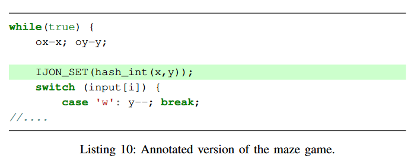

并与AFL，AFLFAST，LAF-INTEL，QSYM，ANGORA对比：

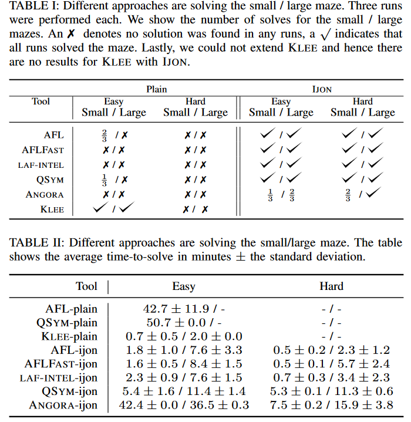

表1作者在Easy(相对容易的原始迷宫)和Hard(作者实现的可以往回走的迷宫)测试了3次，给出了所有fuzzer和符号执行工具KLEE的结果，可以看到有了IJON的支持fuzzer的效果提升很大。

表2表明了解决迷宫的平均时间。

##### 3.2 Super Mario Bros.

作者设定，马里奥只能往右走，并且停下来就死。

作者用了`ijon_max` annotation （listing 9）。

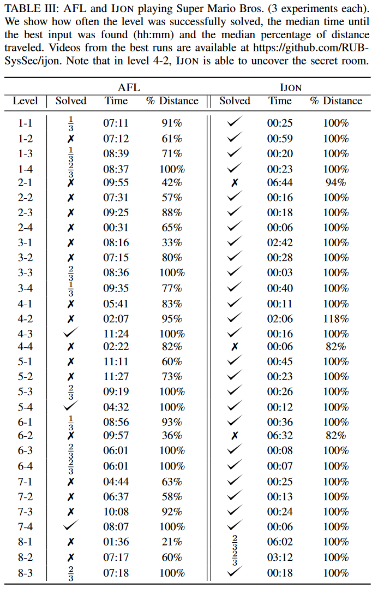

##### 3.3 Structured Input Formats


## 4. AFL bitmap & shared memory

文中指“an entry of bitmap”指的是Bitmap中的一个byte，其值代表了hit count.


>[AFL源码阅读（二）：Main Payload 汇编](https://www.ruanx.net/afl-source-2/)
>
>[afl/docs/technical_details.txt at master · mirrorer/afl](https://github.com/mirrorer/afl/blob/master/docs/technical_details.txt)
