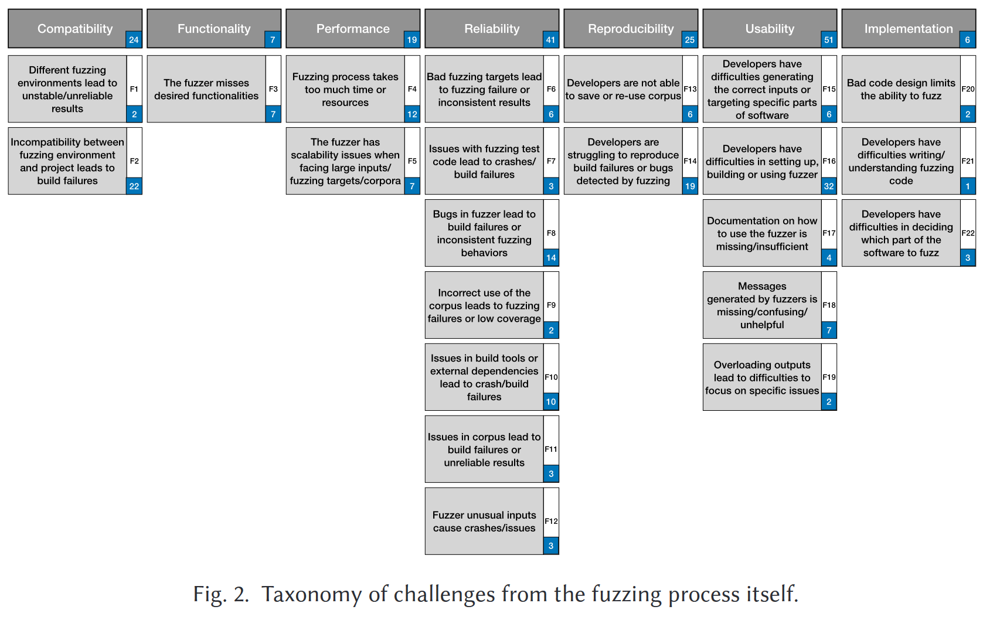
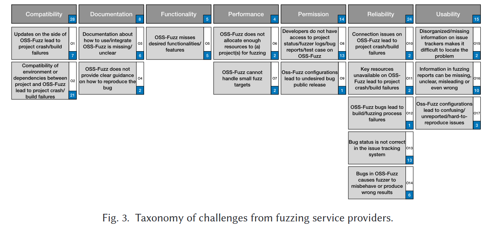

# The Human Side of Fuzzing

An **<u>empirical study</u>** of challenges of fuzzing for developers.

> 作者从Github中的3,721个fuzzing相关的issues中采样了829个，并将其分为22类（fuzzing自身相关）和17类（关于fuzzing service providers）的challenges。并调查开发人员对这些challenges的反馈如何，获取了106个有意义的反馈。

## Challenges developers may face during fuzzing

### 1. Fuzzing process itself:

下图显示了跟fuzzing process本身相关的22类（7大类）challenges：

跟Fuzzing service provider（一些developer可能选择第三方提供的fuzzing服务）相关的challenges:

