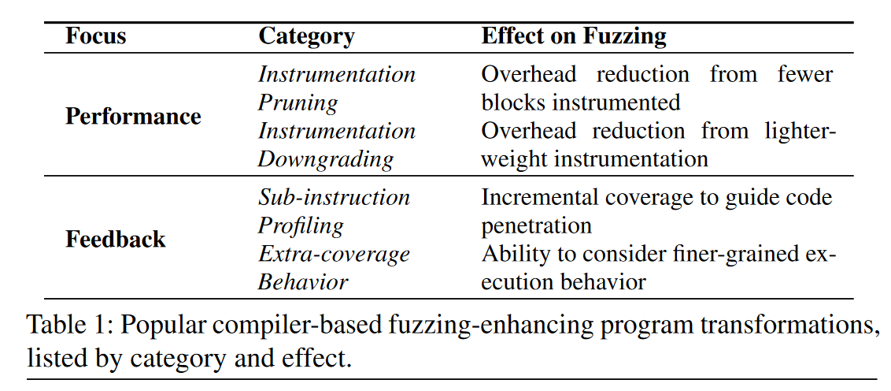
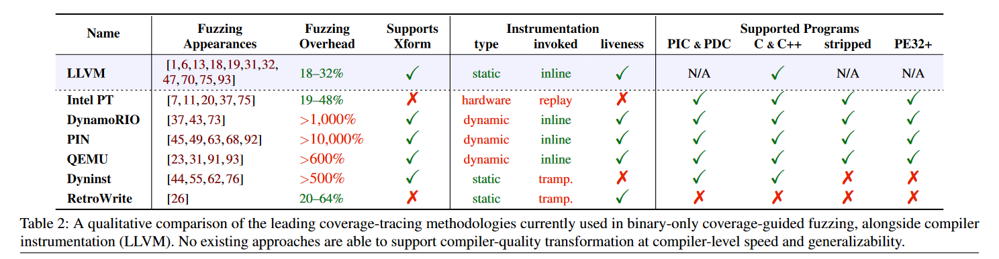
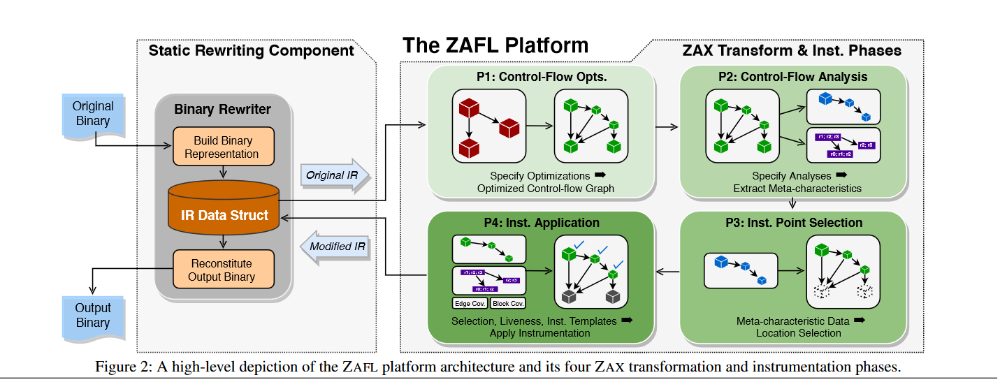

# Breaking Through Binaries: Compiler-quality Instrumentation for Better Binary-only Fuzzing

>PDF: [sec21-nagy.pdf](https://www.usenix.org/system/files/sec21-nagy.pdf)
>
>Other Blogs: [Breaking Through Binaries: Compiler-quality Instrumentation for Better Binary-only Fuzzing | TopicSec](https://topicsec.github.io/posts/binary-only-fuzzing/)

## 1. Motivation

> Although current general-purpose binary instrumentation methods exist, they can not reach compiler-quality capabilities and performance.

#### 1.1 Current Compiler-based Fuzzing Enhancements

The author identify four fuzzing-enhancing tansformation for improving fuzzing process:

###### 1) Instrumentation Pruning 

Eliding instrumenting some basic blocks by: random or CFG graph analysis.

Example: `AFL_INST_RATIO` in AFL/AFL++([https://aflplus.plus/docs/env_variables/](https://aflplus.plus/docs/env_variables/))

###### 2) Instrumentation Downgrading

Downgrading instruction instrumented, like CollAFL.

###### 3) Sub-instruction Profiling

Most fuzzers track edge/block coverage and hence are oblivious to “incremental” predicate progress (“magic bytes” [68], nested checksums [7], and switch cases [1]). 

Some compiler-based fuzzer try to splitting these problems into smaller one.

###### 4) Extra-coverage Behavior Tracking

Context-sensitive coverage, like identifing A->B->C and B->A->C (AFL can not since it only utilize branch cov).

#### 1.2 In Binary Instrumentation

Current binary instrumenters are fundamentally illequipped to support compiler-quality fuzzing instrumentation. We envision a world where binary-only and compiler-based fuzzing are not segregated by capabilities; thus we design a binary-only fuzzing instrumentation platform capable of performant compiler-quality transformation.

## 2. Method

Four Criterion:

>1. Instrumentation added via static rewriting.
>2. Instrumentation is invoked via inlining (because it is faster than trampolining).
>3. Must facilitate register liveness tracking (to avoid using lower register, like eflags).
>4. Support common binary formats and platforms.

ZAFL: (Binary --> IR --> Instrumented Binary)

ZAFL generate optimatized CFG, do defined analysis on it, select instrumentation points and finally do instrumentation.

## 3. Evaluation

1. 它是直接模仿源码插桩吗？

   很大程度上参照了。

2. 还有什么缺陷？

   依赖控制流分析-->二进制控制流分析不完善

   static binary rewriting对混淆软件的支持很差

3. ZAFL 为什么还是比compiler-based instrumentation差？

   